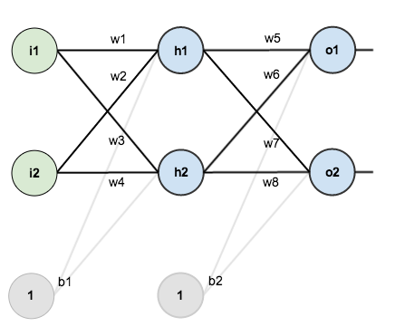
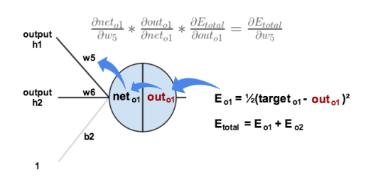
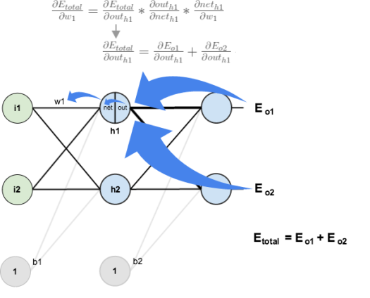

# Neural Network Implementation Using MNIST Data

## Goals for project

* Learn about nerual networks
* Implement nerual network
* Optimize to try and minimize error in guessing the correct category of the data

---

## About the MNIST Data

* Training data is 60,000 images of handwritten numbers
* Grey scale
* [MNIST source](http://yann.lecun.com/exdb/mnist/)

## Important Math

### Goal of the whole thing is Gradient decent (minimizing the cost function)

[A Step By Step BackPropagation Example](https://mattmazur.com/2015/03/17/a-step-by-step-backpropagation-example/)

One hidden layer neural network

| letter | representation |
| --- | --- |
| I | inputs |
| H | hidden layers |
| O | outputs |
| W | weights |
| B | bias |
| E | error |

#### Net input for node

net = w1 * i1 + w2 * i2 + ... + wn * in

Output(x) = sigmoid(x) ; where x is the net equation

#### Sigmoid function (squash)

&sigma; = 1 / (1 + e-x)

#### Error function (squared error)

EOtotal = &Sigma; 1/2 (targetO - outputO)2

#### Gradient with respect to w

&part;Etotal / &part;W = (&Sigma; &part;Etotal / &part;outO * &part;outO / &part;netO * &part;netO / &part;outH) &part;outH / &part;netH * &part;netH / &part;W

#### To update weights:

* &eta; is a learning rate constant

W+ = W + &eta; * &part;Etotal / &part;W

## Overview of the process

### Step 1 backprop

### Step 2 backprop

